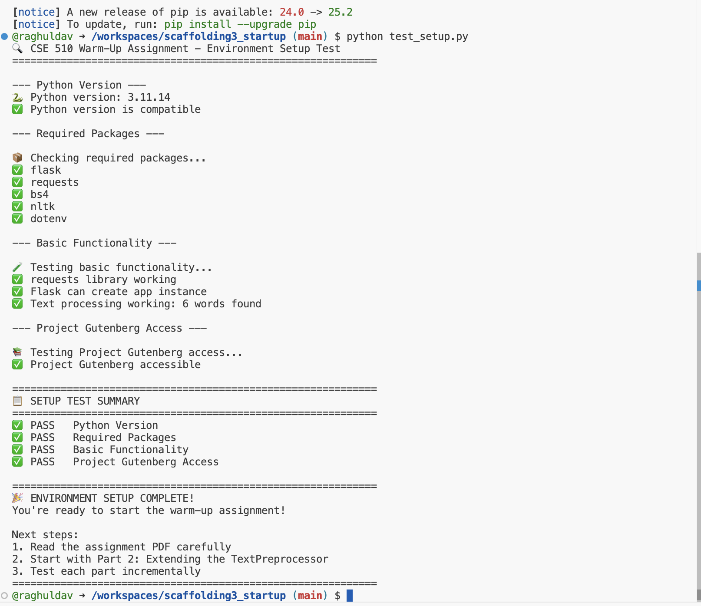
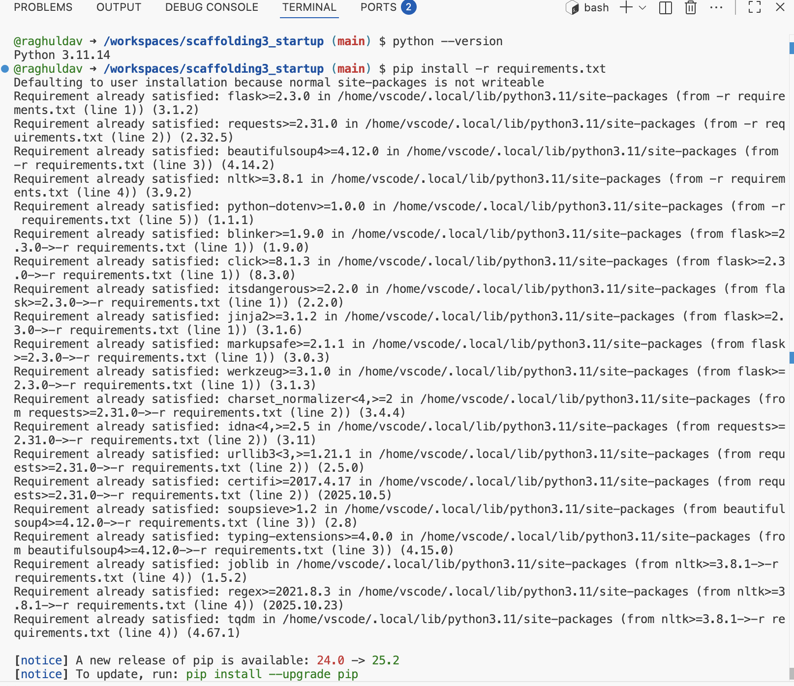
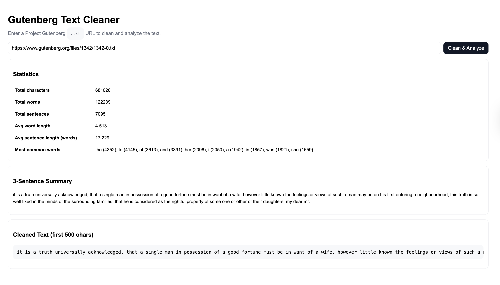
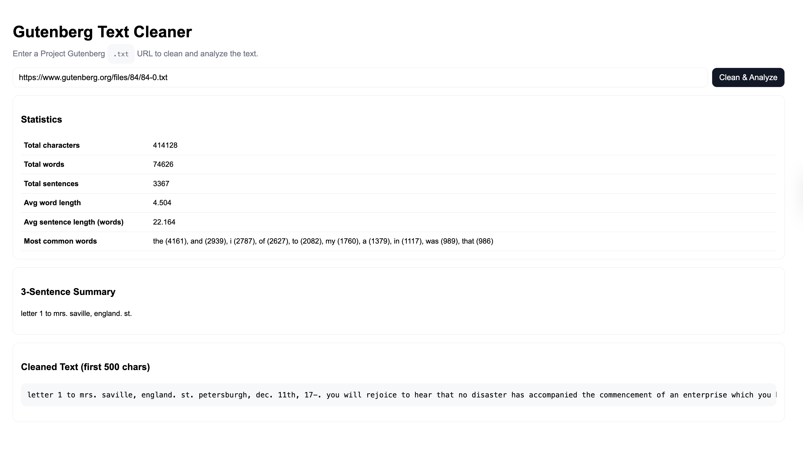
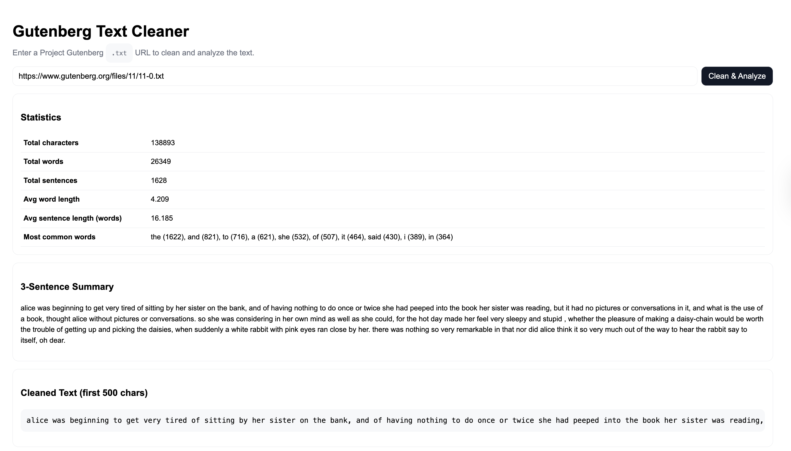

# Scaffolding Assignment 3 - Gutenberg Text Cleaner


Course: Introduction to AI - Fall 2025
Student: raghulch
University at Buffalo


## Overview

This project creates a Flask web app that can download, clean, analyze, and summarize text from Project Gutenberg .txt books.
It was created and tested using GitHub Codespaces, from the scaffolding repository you have been given (scaffolding3_startup).

Here is the full app:

Processes a Project Gutenberg URL.
Cleanses and normalizes the text.
Calculates significant statistics (characters, words, sentences, etc.).
Generates a brief (3 sentence) summary.
Displays first 500 characters of processed text.
Provides a simple, responsive web interface.

## Part Task Steps
### Part 1: Code in GitHub Codespaces 

Fork 
Opened project in GitHub Codespaces.

Verified Flask and dependencies.

Confirmed starter_preprocess.py structure and imports are as expected.




### Part 2: Implementation of Text Preprocessing

All functions yet to be implemented in the file starter_preprocess.py have now been completed:

fetch_from_url() → Downloads plain text from Project Gutenberg.

clean_gutenberg_text() → Eliminates headers, licenses, and other meta information.

normalize_text() → Normalizes to lowercase, standardizes punctuation, while preserving the terminating sentence.

get_text_statistics() → Produces total chars, words, sentences, average, as well as most frequently used words.

create_summary() → Uses NLTK to tokenize sentences, and creates a 3-sentence paragraph that is a brief summary.

I pre-processed some of the books (Pride and Prejudice, Frankenstein) with Python REPL.

### Part 3: Flask API and integration.

I finished the app.py Flask backend with the following routes:

/ - serves index.html UI.

 /api/clean - accepts URL and does complete cleaning + analyis + summary.

 /api/analyze - accepts raw text and returns only statistics.

 /health - Simple test endpoint that returns {ok: True}

/health - Simple test endpoint that returns {ok: True}

Integrated the TextPreprocessor from the file starter_preprocess.py as the API

Included some reasonable checking and handling to check for missing and malformed URLs.
Improved the list of regex cleaning for the TOC as well as stripped any duplicate "Chapter" lines. 
Tested API locally in Codespaces (http://127.0.0.0.1:5000).

### Part 4: Web UI

Developed /templates/index.html as the frontend webpage.

Added:

Nice-looking input form for Gutenberg URLs

"Clean & Analyze" button that makes an AJAX POST request to /api/clean

Processing spinner while cleaning is ongoing

Results div containing statistics, summary, and first 500 cleaned characters

Error handling on invalid URL or network failure

Utilized Bootstrap 5 for responsive design and light styling.

Used the following URLs to test the UI:

(Pride and Prejudice)
(Frankenstein)
(Alice in Wonderland)
(Moby Dick)






Confirmed that cleaning started from the first line of the actual story and did not include the title/license. 


## Set up and run 
Clone and open in Codespaces
git clone https://github.com/raghuldav/scaffolding3_startup.git
cd scaffolding3_startup

Install dependencies
python --version
pip install -r requirements.txt

Run the app
python app.py

Open in your browser
Go to → http://127.0.0.1:5000

## URLs to try

Pride and Prejudice
Frankenstein
Alice in Wonderland
Moby Dick

## Key Learnings

Web scraping & cleaning natural language data
Content normalization through regex
Flask API design & routing
Using asynchronous JS fetch and handling JSON
Building simple AI preprocessing pipelines
The deployment and testing workflow in GitHub Codespaces

## Project Structure

```text
scaffolding3_startup/
├── app.py                    # Backend Flask app
├── starter_preprocess.py     # Preprocessing, cleaning and analysis
├── templates/
│   └── index.html            # Frontend UI
├── docs/
│   ├── screenshots/          # Screenshots of app
├── README.md                 # Documentation on the project
└── requirements.txt          # Requirements (Flask, requests, bs4, nltk)
